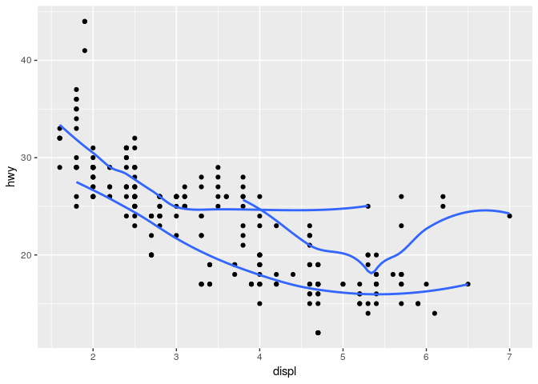
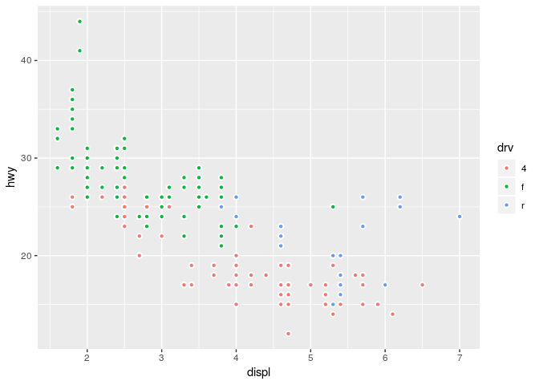
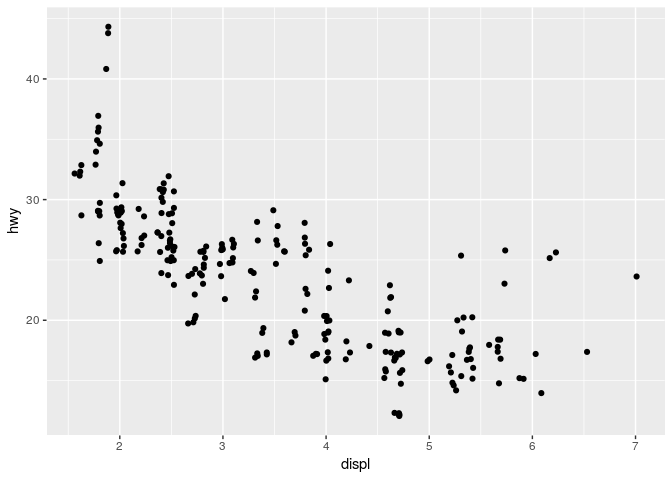
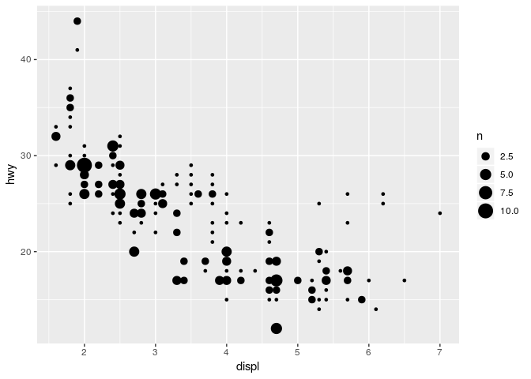
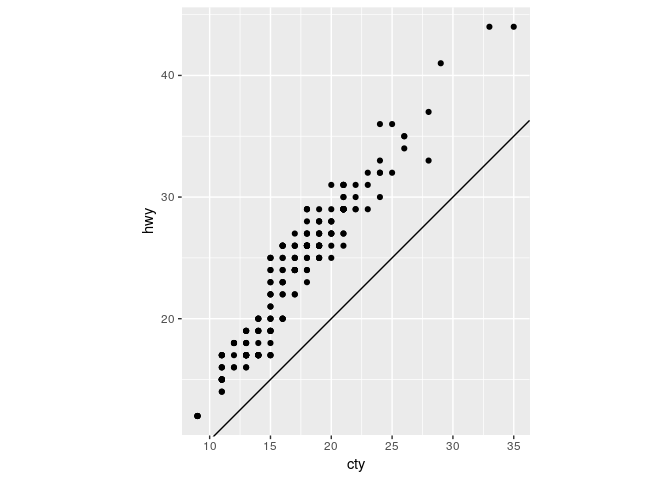
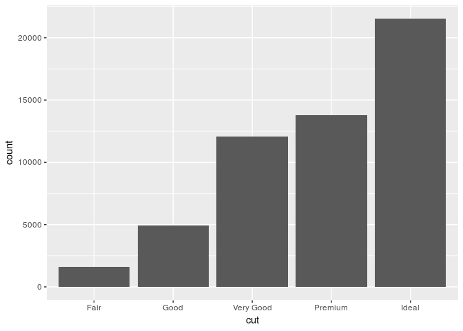
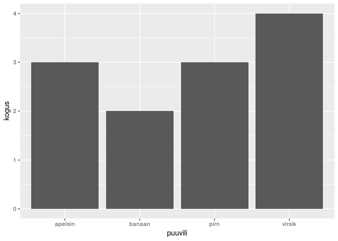

Homework 2: ggplot
================
2019-03-08

``` r
library(tidyverse)
```

    ## ── Attaching packages ───────────────────────────────────────────────────────────────────────────────── tidyverse 1.2.1 ──

    ## ✔ ggplot2 3.1.0       ✔ purrr   0.3.0  
    ## ✔ tibble  2.0.1       ✔ dplyr   0.8.0.1
    ## ✔ tidyr   0.8.2       ✔ stringr 1.4.0  
    ## ✔ readr   1.3.1       ✔ forcats 0.4.0

    ## ── Conflicts ──────────────────────────────────────────────────────────────────────────────────── tidyverse_conflicts() ──
    ## ✖ dplyr::filter() masks stats::filter()
    ## ✖ dplyr::lag()    masks stats::lag()

  - Take the first faceted plot in this section:

<!-- end list -->

``` r
ggplot(data = mpg) + 
  geom_point(mapping = aes(x = displ, y = hwy)) + 
  facet_wrap(~ class, nrow = 2)
```

<!-- -->

What are the advantages to using faceting instead of the colour
aesthetic? What are the disadvantages? How might the balance change if
you had a larger dataset?

Kui andmepunkte on palju ja nad on ühes kohas koos, hakkavad nad aes
colour kasutades kattuma ja graafik pole enam loetav. Samas võib olla
facet\_wrap kasutades andmeid raskem võrrelda. Kui andmeid on vähe, pole
mõtet teha suurt hulka graafikuid, millel kõigil on vaid mõned punktid.

  - Recreate the R code necessary to generate the following
graphs.

<!-- end list -->

``` r
knitr::include_graphics(paste0("plots/fig", 1:6, ".png"))
```


``` r
ggplot(data = mpg, mapping = aes(x = displ, y = hwy), show.legend = FALSE) +
  geom_point() + 
  geom_smooth(se=FALSE)
```

    ## `geom_smooth()` using method = 'loess' and formula 'y ~ x'

<!-- -->

``` r
ggplot(data = mpg, mapping = aes(x = displ, y = hwy, group=drv), show.legend = FALSE) +
  geom_point() + 
  geom_smooth(se=FALSE)
```

    ## `geom_smooth()` using method = 'loess' and formula 'y ~ x'

<!-- -->

``` r
ggplot(data = mpg, mapping = aes(x = displ, y = hwy, group=drv, color=drv)) +
  geom_point() + 
  geom_smooth(se=FALSE)
```

    ## `geom_smooth()` using method = 'loess' and formula 'y ~ x'

<!-- -->

``` r
ggplot(data = mpg, mapping = aes(x = displ, y = hwy)) +
  geom_point(aes(color=drv)) + 
  geom_smooth(se=FALSE)
```

    ## `geom_smooth()` using method = 'loess' and formula 'y ~ x'

<!-- -->

``` r
ggplot(data = mpg, mapping = aes(x = displ, y = hwy)) +
  geom_point(aes(color=drv)) + 
  geom_smooth(aes(linetype=drv), se=FALSE)
```

    ## `geom_smooth()` using method = 'loess' and formula 'y ~ x'

<!-- -->

``` r
ggplot(data = mpg, mapping = aes(x = displ, y = hwy, fill=drv)) +
  geom_point(shape=c(21), color="white", stroke=1, size=1.5)
```

<!-- -->

  - Most geoms and stats come in pairs that are almost always used in
    concert. Read through the documentation and make a list of all the
    pairs. What do they have in common?

geom\_bar() stat\_count(), geom\_bin2d() stat\_bin2d(), geom\_boxplot()
stat\_boxplot(), geom\_col() stat\_identity(), geom\_count()
stat\_sum(), geom\_density() stat\_density(), geom\_density\_2d()
stat\_density\_2d(), geom\_hex() stat\_binhex(), geom\_freqpoly()
stat\_bin(), geom\_qq\_line() stat\_qq\_line(), geom\_quantile()
stat\_quantile(), geom\_smooth() stat\_smooth(), geom\_violin()
stat\_ydensity, geom\_sf() stat\_sf()

geom asemel on võimalik kasutada stat funktsioone

  - Compare and contrast geom\_jitter() with geom\_count().

<!-- end list -->

``` r
ggplot(data = mpg, mapping = aes(x = displ, y = hwy)) +
  geom_jitter()
```

<!-- -->

``` r
ggplot(data = mpg, mapping = aes(x = displ, y = hwy)) +
  geom_count()
```

<!-- --> Jitter lisab
graafikule “müra” punktidena, count muudab graafikul suuremaks need
punktid, kus on ülekattuvus - mida rohkem kattuvaid punkte, seda suurem
punkt luuakse.

  - What does the plot below tell you about the relationship between
    city and highway mpg (fuel consumption)? Why is coord\_fixed()
    important? What does geom\_abline() do?

Maanteel saab kõigi nende autodega sõita rohkem miile kui linnas.
coord\_fixed() teeb x ja y telje ühikud sama pikaks ja seega graafiku
paremini loetavaks. geom\_abline() lisab referentsjoone.

``` r
ggplot(data = mpg, mapping = aes(x = cty, y = hwy)) +
  geom_point() + 
  geom_abline() +
  coord_fixed()
```

<!-- -->

  - What is the default geom associated with stat\_summary()?

geom\_pointrange()

``` r
ggplot(data = diamonds) + 
  stat_summary(
    mapping = aes(x = cut, y = depth),
    fun.ymin = min,
    fun.ymax = max,
    fun.y = median
  )
```

<!-- -->

How could you rewrite the previous plot to use that geom function
instead of the stat function?

``` r
ggplot(data = diamonds) + 
  geom_pointrange(
    mapping = aes(x = cut, y = depth),
    stat="summary",
    fun.ymin = min,
    fun.ymax = max,
    fun.y = median
  )
```

<!-- --> - What does
geom\_col() do? How is it different to geom\_bar()?

``` r
ggplot(data = diamonds) + 
  geom_bar(mapping = aes(x = cut))
```

<!-- -->

``` r
puuviljasalat <- data.frame(puuvili = c("banaan", "apelsin", "pirn", "virsik"), kogus = c(2, 3, 3, 4))
ggplot(puuviljasalat, aes(puuvili, kogus)) +
  geom_col()
```

<!-- -->

geom\_bar arvutab tulba kõrguse loendades või proportsiooni leides,
geom\_col puhul on tulba kõrguseks andmetes olemasolev väärtus

  - What variables does stat\_smooth() compute? What parameters control
    its behaviour?

Arvutab: y - predicted value, ymin - lower pointwise confidence interval
around the mean, ymax - upper pointwise confidence interval around the
mean, se - standard error

Parameetrid: method, formula, na.rm

  - In our proportion bar chart, we need to set group = 1. Why? In other
    words what is the problem with these two graphs?

Ei näe klassidevahelisi proportsioone.

``` r
ggplot(data = diamonds) + 
  geom_bar(mapping = aes(x = cut, y = ..prop..))
```

<!-- -->

``` r
ggplot(data = diamonds) + 
  geom_bar(mapping = aes(x = cut, fill = color, y = ..prop..))
```

<!-- -->

``` r
ggplot(data = diamonds) + 
  geom_bar(mapping = aes(x = cut, y = ..prop.., group=1))
```

<!-- -->
